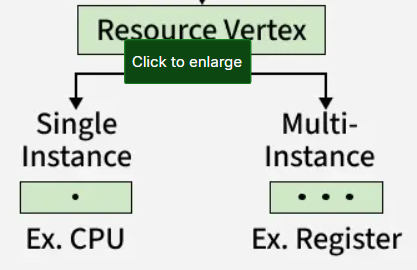
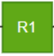
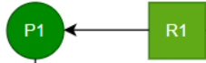
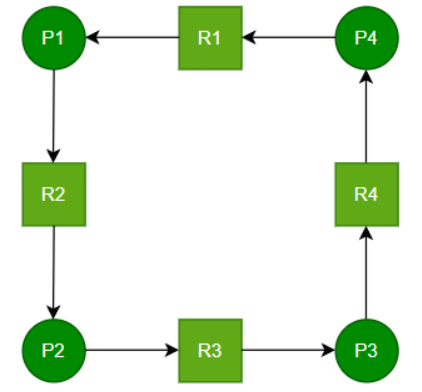
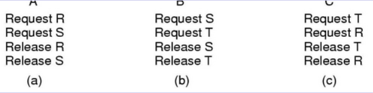
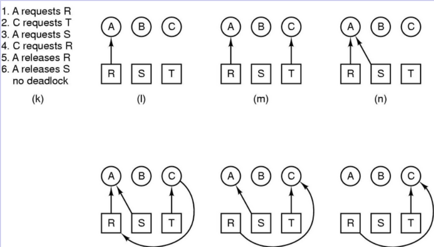

# Betriebsmittelzuteilungsgraphen/Resource Allocation Graph(RAG)

sind eine visuelle Darstellung, die verdeutlichen, wie Ressourcen in einem Betriebssystem zugewiesen werden. Anstatt nur Tabellen zu verwenden, um darzustellen, welche Ressourcen zugewiesen, angefordert oder verfügbar sind, nutzt das RAG Knoten und Kanten, um die Beziehungen zwischen Prozessen und den von ihnen benötigten Ressourcen anschaulich darzustellen.

- Das RAG zeigt, welche Ressourcen zugewiesen sind und welche von Prozessen angefordert werden.
- Es hilft dabei, Deadlocks deutlicher zu visualisieren als Tabellen.
- Das RAG zeigt, wie sich Zuweisungen und Anforderungen auf das gesamte System auswirken.

## Bestandteile

| Thread | Ressource | Belegung | Anforderung |
| ------ | --------- | -------- | ----------- |
|    Runde Ecken/Kreis|    Rechteck|  |    Auch als gestrichelter Pfeil möglich|
   
   
   

   
   
   
Ein Deadlock tritt zwingend auf, wenn der Graph einen Zyklus enthält und jede Ressource nur eine Instanz bereitstellt. In diesem Fall wartet jeder beteiligte Thread auf eine Ressource, die von einem anderen Thread im Zyklus gehalten wird. Keiner kann fortfahren. Handelt es sich jedoch um einen Graphen, in dem die Ressourcen mehrere Instanzen bereitstellen, sind Zyklen zwar ein notwendiges Kriterium für Deadlocks, jedoch nicht hinreichend (--> Zyklus bedeutet dann nicht automatisch Deadlock).
Beispiel mit 3 Abläufen, 3 Betriebsmitteln (mit jeweils einer Instanz) und folgendem Aufbau der Abläufe:
   

   
   
| Ausführung mit Deadlock | Ausführung mit Deadlock |
| ----------------------- | ----------------------- |
|  |  |

